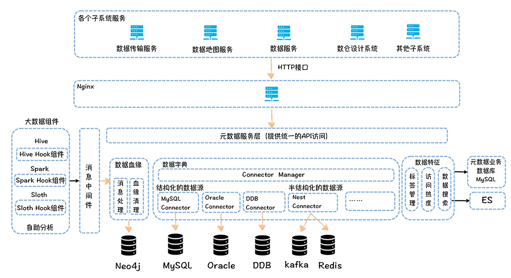

# 元数据分类
## 数据字典
数据字典描述的是数据的结构信息，包括：表名、注释信息、表的产出任务、有哪些字段、字段含义、字段类型
## 数据血缘
数据血缘是指一个表是直接通过哪些表加工而来，通过数据血缘可以进行故障溯源和影响分析
## 数据特征
数据特征主要是指数据的属性信息，如：存储空间大小、访问热度、主题域、分层、表的关联指标

# 业界元数据中心产品
## Metacat
多数据源可扩展架构设计
## Apache Atlas
血缘采集：通过静态解析SQL，获得输入表和输出表；解析执行计划，获取输入表和输出表；通过任务日志解析的方式，获取执行后的SQL输入表和输出表
## Cloudera Navigator

# 网易元数据中心设计
## 关键目标
### 多业务线、多租户支持
电商、音乐不同的业务线，统一业务线内算法、数仓、风控多个租户
### 多数据源支持
MySQL、Hive等不同类型的数据源，半结构化的KV也纳入管理
### 数据血缘
元数据中心需要支持数据血缘的实时采集和高性能的查询，同时还必须支持字段级别的血缘
### 与大数据平台集成
自助取数、自助分析、数据传输、数据服务以及权限管理，都应该基于元数据中心提供的统一接口获取元数据
### 数据标签
支持对表和字段打标签，完善数据中台数据的特征，比如：指标、主题域、分层都可以作为不同类型的标签关联到表上

## 技术实现

### 数据血缘
基于Hive Hook、Spark Listener、Flink Hook，将任务执行时输入表和输出表推送给消息中间件Kafka，由消费端将血缘关系沉淀到图数据库Neo4j中；血缘清理负责定时清理过期的血缘。
### 数据字典
参考Metacat实现，对于Hive、Mysql元数据中心会直接连接数据源实时获取系统元数据，对于Kafka、Hbase、Redis等KV，元数据中会内置数据源管理模块定义Value的schema信息。
### 数据特征
元数据中心内置了不同类型的标签，同时允许用户自定义扩展标签类型，指标、分层、主题域都是以标签形式存储在元数据中，同时支持用户基于标签搜索表和字段。
### API访问接口
元数据中心统一对外提供API访问接口，数据传输、数据地图、数据服务、权限控制等其他系统都可以通过API接口获取元数据。

# 数据地图
## 元数据中心界面
数据地图是基于元数据中心构建的一站式企业数据资产目录，可看作是元数据中心的界面展示。
## 多维度检索和导览
数据使用者可以在数据地图上完成数据的检索，解决“找数据”的问题。既可以按表名、列名检索，也可以按照主题域、分层、业务过程进行导览。
## 表详情
展示表的基础信息，包括字段信息、分区信息、产出信息、数据预览以及上下游血缘关系