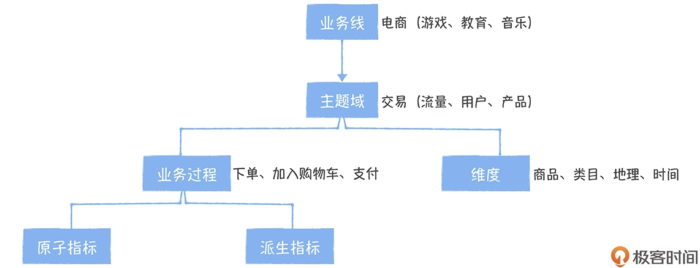

# 指标常见问题
## 相同指标名称，口径定义不同
如指标“新用户销售额”，口径一是首次下单并完成支付的用户，口径二是当日新注册用户。
## 相同口径，指标名称不一样
如指标“优惠券抵扣金额”和“优惠券消耗金额”两个的口径定义一致，但由于名称不同会引起歧义。
## 不同限定词，描述相同事实过程的两个指标，相同事实部分口径不一致
如“黑卡会员购买用户数”和“非会员购买用户数”两个指标，都是描述的下单购买商品的这个业务过程，只是限定词一个是黑卡会员另一个是非会员。按照一致性原则对于购买用户数这个事实，口径和计算逻辑应该一致，然而可能会出现一个包含关单另一个不包含的情况
## 指标口径描述不清晰
如“关单金额”，口径描述为“关闭订单的金额”，而“关闭订单”可以理解为“支付成功后关闭订单”，也可以理解为“支付完成前取消订单”
## 指标口径描述错误
如“7日UV”，口径定义为7日内日均UV，根据口径定义应该是将近7日UV相加之后除以7取平均值，这个定义在业务场景中是有问题的，正确的口径应该是7日内有登录过去重的用户数
## 指标命名难于理解
如“ROI”，表示投资回报率，在优惠券、商品降价促销都可以计算ROI。但是“ROI”不能明确描述的业务过程，所以比较好的命名应该是“（商品|类目|通用）优惠劵ROI”
## 指标数据来源和计算逻辑不清晰
如果指标数据来源不清楚，一旦这个指标数据异常，就很难去做溯源。另外，有些指标的计算逻辑比较复杂，仅仅凭借业务口径一段描述，使用指标的人还是无法理解这个指标的计算逻辑，这个时候就需要有一些伪码或者SQL描述。

# 规范化定义指标

## 面向主题域管理
为了提高指标的管理效率，需要按照业务线-》主题域-》业务过程三级目录方式管理指标，指标中的主题域和数仓中的主题域概念和逻辑需要保持一致，数仓中的主题域见其他章节
## 拆分原子指标和派生指标
如果修饰词有对应的维表，就可以作为派生指标，如果修饰词没有对应的维表，就作为原子指标管理。例如，指标“新会员消费额”中“新会员”没有对应的维表，就不能作为派生指标；“黑卡会员消费额”中“黑卡会员”属于会员维度属性，所以可以作为派生指标。
### 统计周期+统计粒度+业务限定+原子指标 -》 派生指标
### 描述的业务过程+度量 -》 原子指标
## 指标命名规范
### 基本原则
* 易懂，根据指标名称可以判断指标归属的业务过程
* 统一，派生指标和它继承的原子指标命名一致
### 原子指标
* 指标名称：动作+度量，如注册用户数
* 指标标识：英文缩写，buyer_num
### 派生指标
* 指标名称：时间周期+统计粒度+修饰词+原子指标，如近30天黑卡会员购买用户数
* 指标标识：修饰词_原子指标_时间周期，black_vip_buyer_num_l30d
## 关联应用和可分析维度
* 指标被哪些应用引用
* 可以从哪些维度进行指标的分析
## 指标分级管理
### 一级指标
* 数据中台直接产出，核心指标、原子指标及跨部门派生指标
* 确保指标的质量和实效性，由数据中台负责创建
### 二级指标
* 基于中台提供的原子指标，业务部门自己创建派生指标
* 允许业务方自己创建，数据中台不保证时效和质量

# 指标系统
## Excel不适合管理指标
* 难于共享
* 缺少权限管理
* 无法动态更新
* 指标无法和数仓模型动态关联
## 指标系统和元数据中心的关系
* 指标系统是基于元数据中心构建的一个指标管理工具，它从元数据中心自动同步数仓的主题域和业务过程，按照规范化定义创建指标
* 新创建的指标同时会以标签的形式下沉到元数据中心对应的表和字段上，这样在数据地图上就可以搜索到关联到表的指标
## 指标系统的功能
* 按照规范化定义创建指标
* 按名称、标识、业务口径检索指标
# 基于指标系统构建全局的指标字典
指标治理的最终结果就是要形成一个全局业务口径一致的指标字典，让使用指标的人可以通过指标字典快速了解指标的业务含义和计算过程，不会对指标口径产生歧义。构建全局指标字典有两个场景
## 面对一个新的指标需求，如何基于指标系统完成指标开发流程
* 指标需求方、数据开发、应用开发进行需求评审，确认是否为新指标，原子指标还是派生指标
* 已存在的指标通过数据服务进行发布，交付时间短；新指标需要开发，排期交付时间长
## 面对一个已存在的、混乱的指标现状，如何进行全局梳理
* 成立工作小组，由数据产品或分析师组成专门负责指标的全局梳理
* 明确指标梳理目标，涉及的业务线
* 盘点使用的数据报表和产品，并把没有的报表和产品下线
* 对于数据报表和产品中的指标，收集以下信息
  * 指标展示名称，购买用户数
  * 指标标识，buyer_num
  * 业务口径，支付成功的购买用户数量，按统计周期去重
  * 数据来源，dwd_trd_bg_item_di
  * 分析维度，商品、类目、流量来源、品牌
  * 数据应用（报表），报表链接
  * 计算逻辑，SQL/或伪代码
* 明确指标的业务口径，口径相同的去重，关联的应用合并
* 根据指标业务口径，明确所属的主题域和业务过程
* 区分指标类型，对于派生指标明确统计粒度、修饰词、时间周期和关联的原子指标
* 按照指标的规范化定义，把整理好的指标录入到指标系统
