# 设计图纸——方法论

2016年阿里提出数据中台建设的核心方法论：OneData和OneService

## OneData
OneData就是所有数据只加工一次，不会因为不同的应用场景不同的部分数据进行重复加工。OneData体系的目的是构建统一的数据规范标准，让数据成为一种资产，而不是成本。资产和成本的差别在于资产是可以沉淀的，是可以被复用的。成本是消耗性质的、是临时的、无法被复用的。
### 分主题域管理
把数据表划分到不同的主题域，比如在电商业务中，商品、交易、流量、用户、售后、配送、供应链都可以作为主题域，好的主题域划分是相对稳定，尽可能地覆盖绝大多数的表。
### 命名规范定义
对表的命名进行规范化统一，表的名称中最好能携带表的主题域、业务过程、分层以及分区信息。如对于仓储域中的一张入库明细表，规则命名可以为：dwd(分层：明细层)_wms(主题域：仓库域)_inbound(业务过程：入库)_item_info(内容：基础信息)_di(分区规则：每日增量)
### 指标一致
构建全局的指标字典，确保所有表中相同指标的口径必须一致(其他章节)
### 数据模型复用
数据中台采用分层设计方式，包括：ODS原始数据层、DWD明细数据层、DWS轻度汇总数据层、ADS/DM应用数据层/数据集市层。

### 数据完善
数据中台的数据必须尽可能的覆盖所有的业务过程，数据中台中的每一层的数据也要尽可能完善，让数据使用者尽可能地使用汇总后的数据。
## OneService
数据即服务，强调数据中台中的数据应该是通过API接口的方式被访问，提高数据的共享能力。
* 一方面API接口对应用开发屏蔽了底层数据存储，使用统一标准的API接口查询数据提高了数据接入的速度。
* 另一方面，对于数据开发提高了数据应用的管理效率，建立了表到应用的链路关系。
### 屏蔽异构数据源
数据服务必须要能支撑类型丰富的查询引擎，满足不同场景下数据的查询需求，常见的有MySQL、HBase、GreenPlum、Redis等。
### 数据网关
要实现包括权限、监控、流控、日志在内的一系列管控能力。
### 逻辑模型
可以类比视图，帮助应用开发者屏蔽底层的数据物理实现，实现相同粒度的数据构造一个逻辑模型，简化数据接入的复杂度。
### 性能和稳定性
可用性和性能。

# 工具——支撑技术

## 以Hadoop为代表的大数据计算、存储基础设施
以Hadoop为代表的大数据计算、存储基础设施提供了大数据运行所必须的计算、存储资源。以HDFS为代表的分布式文件系统，以Yarn/Kubernates为代表的资源调度系统，以Hive、Spark、Fink为代表的分布式计算引擎，都属于基础设施范畴。
## 大数据平台
在Hadoop智商，是大数据平台范畴内的工具产品，覆盖了从数据集成、数据开发、数据测试到数据运维的整套工具链产品。同时还包括基础的监控运维系统、权限访问控制系统和项目用户的管理系统。由于涉及多人协作，所以还有流程协作与通知中心。
## 数据治理
数据治理模块是数据中台的核心组成部分，对应的方法论就是OneData体系。以元数据中心为基础，在统一了企业所有数据源的元数据基础上，提供了包括数据地图、数据设计、数据质量、成本优化以及指标管理在内的5个产品，分别对应的是数据发现、模型、质量、成本和指标的治理。
## 数据服务
数据服务是数据中台的门户，对外提供统一的数据服务，对应的方法论就是OneService。数据服务向下提供了应用和表的访问关系，使数据血缘延伸到数据应用，向上支撑各种数据应用和服务。
## 数据产品和应用
在数据服务之上，是面向不同场景的数据产品和应用，包括面向非技术人员的自助取数系统；面向数据开发、分析师的自主分析系统；面向敏捷数据分析场景的BI产品；活动直播场景下的大屏系统；以及用户画像相关的标签工厂。

# 施工队伍——组织架构
数据中台提供的是一个跨业务部门共享的公共数据能力
## 独立于业务线的中台组织部门
## 中台团队必须深入业务，懂业务
## 中台团队的组织机构
* 数据产品部门：负责数据中台、数据产品的体系规划、产品设计、规范制定、应用效果跟进，指标口径的定义和维护
* 数据平台部门：负责研发支撑数据中台构建的产品，例如指标系统、元数据中心、数据地图等
* 数据开发团队：负责维护数据中台的公共数据层，满足数据产品定制的数据需求
* 应用开发团队：负责开发数据应用产品，比如报表系统、电商中的供应链系统、高层看板、经营分析
## 中台组织的绩效目标要与业务落地价值绑定