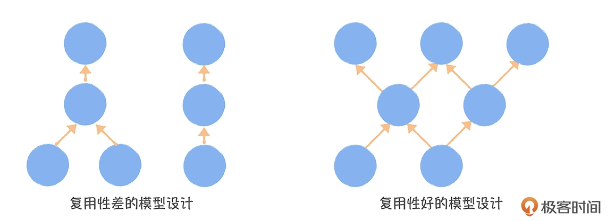
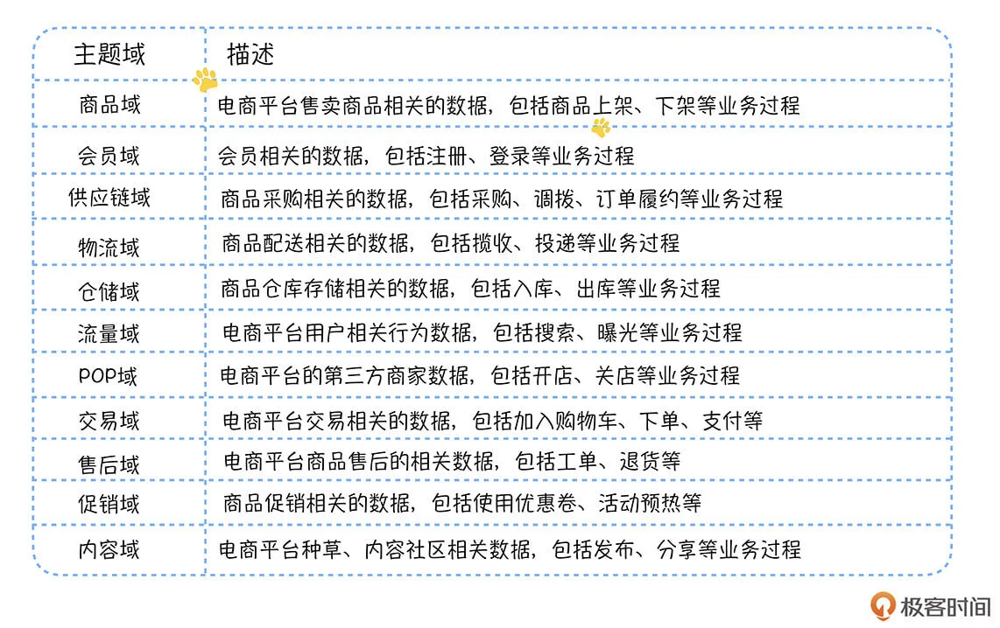
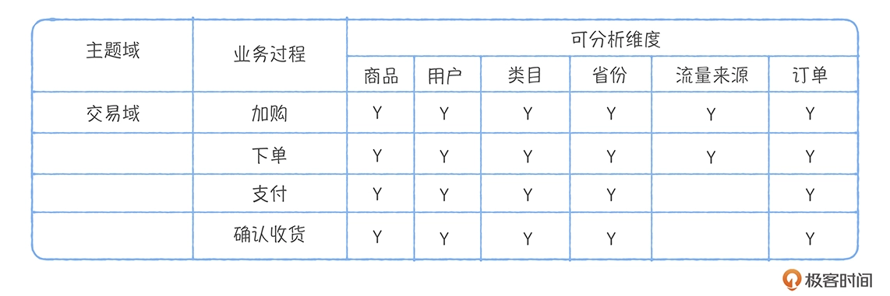

让数据成为一种资产
# 如何评价数仓模型设计的好坏
## 完善度
### DWD跨层引用率
DWD跨层引用率：ODS层直接被DWS/ADS层引用的表，占所有ODS层表(仅统计活跃表)的比例。引用率越低越好，如果引用率越高就说明越多的任务是基于原始数据进行深度聚合计算的，明细数据没有积累无法被复用，数据清洗、格式化、集成存在重复开发。在数据中台模型设计规范中不允许出现跨层引用，ODS层数据只能被DWD引用。
### DWS/ADS汇总数据查询比例
DWS/ADS汇总数据查询比例：DWS/ADS层的查询占所有查询的比例。汇总数据查询比例越高越好，值越高说明上层的数据建设越完善，越能满足数据使用需求，对于使用数据的人来说查询速度和成本会减少。如果汇总数据不能满足需求，使用数据的人就必须使用明细数据，甚至是原始数据。
## 复用度

### 模型引用系数
模型引用系数：一个模型被读取直接产出下游模型的平均数量。引用系数越高说明数仓模型的复用性越好。数据中台模型设计的核心就是追求模型的复用和共享，通过元数据中心的数据血缘图观察，一个比较差的模型设计自下而上是一条条线，而理想的模型设计应该是交织的发散性结构。
比如1张DWD层的表被5张DWS层表引用，这张DWD层表的引用系数就是5，如果把所有DWD层表引用系数取平均值，则为DWD层表平均模型引用系数，一般低于2比较差，3及以上相对较好。
## 规范度
### 无分层、主题域、业务过程归属的表数量
没有分层、主题域、业务过程的表很难被检索，也无法复用
### 命名不规范的表数量
分层、主题域、业务过程、内容信息、分区信息
### 字段命名不一致的表数量

# 从烟囱式的小数仓到共享的数据中台
建设数据中台本质就是构建企业的公共数据层，把原先分散的、烟囱式的、杂乱的小数仓合并成一个可共享、可复用的数据中台
## 接管ODS层，控制源头
确保数据从业务系统产生后进入数据仓库时，只能在数据中台保存一份，只有数据中台账号才能同步业务数据。ODS层表的数据必须和数据源的表结构和记录保持一致且高度无损。ODS层表命名采用：ODS_业务系统数据库名_业务系统数据库表名
## 划分主题域，构建总线矩阵
主题域是业务过程的抽象集合，业务过程是企业经营过程中不可拆分的行为事件，如：仓储管理里面有入库、出库、发货、签收都是业务过程，抽象出来的主题域就是仓储域。好的主题域划分需要尽量覆盖所有业务、相对稳定、可扩展（新加入一个主题域，不影响已存在的主题域和表）。
构建总线矩阵，明确每个主题域下的业务过程有哪些分析维度。

## 构建全局一致性维度
构建全局一致性维度，保证跨主题域进行分析。维度统一在于维度属性的整合，例如商品维度，商品类别、商品品牌、商品尺寸等商品的属性成为维度属性。针对一个维度，其维表的组成方式：
* 公共维度属性和特有维度属性拆成。例如自营平台中只有少数商品有店铺这个属性，所以需要把“店铺”和“商品类型”、“品牌”分开设计维表
* 产出时间相差较大的维度属性拆分。保证核心维表尽早产出
* 更新频繁和变换缓慢的维度属性拆分。保证维表产出的稳定性

## 事实表整合
* 把相同业务过程中相同粒度的数据整合到一个事实表中，补全数据并明确主题域
* 修改从ODS层直接产出DWS/ADS层的任务，增加DWD层数据表引用，避免跨DWD层引用

## 模型开发
* 配置任务依赖，避免数据空跑带来的资源浪费和数据错误
* 任务运行中产生的临时表要及时删除，避免存储空间占用
* 任务名称和表名保持一致，便于查询
* 表生命周期管理，对于ODS和DWD层一般保存历史数据，对于DWS/ADS需要设置生命周期
* DWD层使用压缩方式存储

## 应用迁移

# 数仓建模工具
## 基于元数据中心构建，通过数据血缘关系计算出评价数仓模型设计好坏的指标
## 按照主题域、业务过程、分层的方式管理所有表模型
## 提供维度、度量和字段基础字典的管理