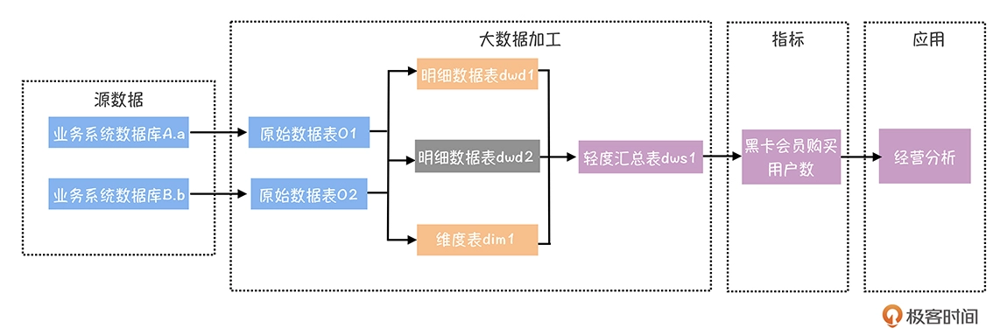
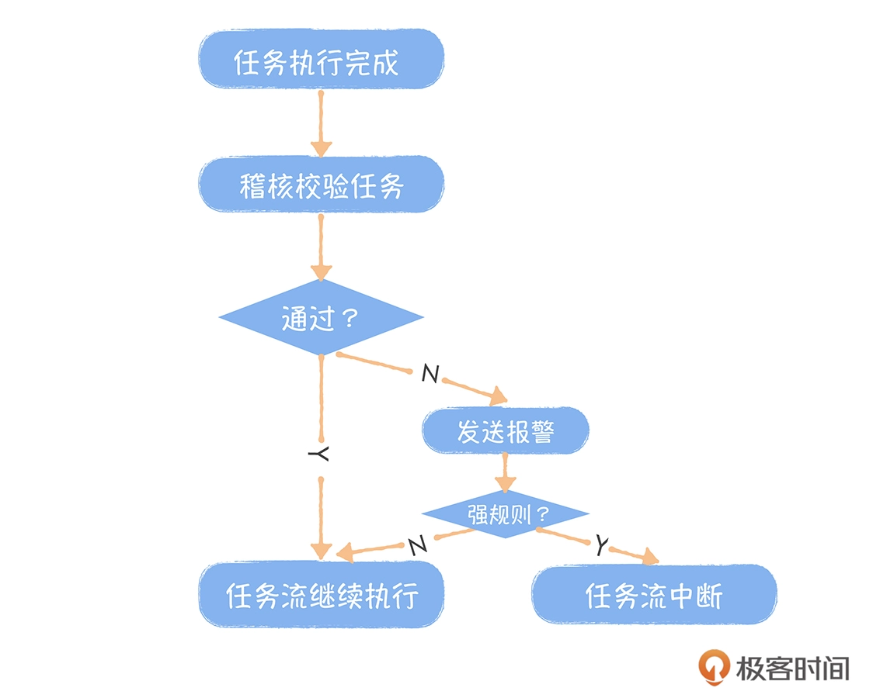

# 数据质量存在问题
* 数据部门晚于业务方发现数据异常，被投诉后才发现问题
* 出现问题后，数据部门无法快速定位到数据异常的根源，排查用了较长的时间
* 故障发生在数据加工链路的上游顶端，出现问题没有第一时间报警处理，导致问题修复时，所有下游链路上的任务都要运行，修复时间成本非常高

# 数据质量问题的根源
## 业务源系统变更
* 源系统数据库表结构变更。表模型发生变更，没有通知到数据团队，导致数据同步任务或者数据清洗任务异常，影响下游数据产出
* 源系统环境变更。扩容后的日志服务器没有配置日志同步任务，导致数据计算结果不准确
* 源系统日志数据格式异常。
## 数据开发BUG
数据开发BUG导致出现数据质量问题的情况占总体数据质量问题的60%以上，常见的例子：
* 任务上线时，代码中引用的测试库没有修改为线上库
* 任务上线时，使用的是固定分区，没有切换成分区变量
* 数据格式处理错误，忽略了异常处理
* 依赖配置出错，导致上游任务还没有完成当前任务就开始执行

## 物理资源不足
资源不足，导致大量任务延迟
* 买量、促销等导致数据量暴增，已有任务消耗更多的资源
* 新开发的不合理任务占用大量资源

## 基础设施不稳定
出现概率小，但影响全局，如Hadoop集群的BUG等

# 如何提高数据质量
早发现，先于数据使用方发现数据的问题，尽可能在出现问题的源头发现问题，为早恢复争取时间；早恢复，缩短故障恢复的时间，降低故障对数据产出的影响。
## 建立全链路监控

业务系统的源数据库表是起点，经过数据中台的加工产出指标，数据应用是链路的终点。基于数据血缘关系，建立全链路数据质量监控，可快速定位问题出现的上游链路和下游影响。
## 添加稽核校验任务
在数据加工任务中，对产出表按照业务规则，设计一些校验逻辑，确保数据的完整性、一致性和准确性，是提升数据质量最行之有效的方法

* 完整性规则，确保数据记录是完整的，不丢失。表数据量的绝对值监控和波动率监控，主键唯一性监控，字段为0或null监控
* 一致性规则，确保数据在不同模型中是一致的。不同模型中，商品购买用户数、商品访问用户数和商品购买率是否一致
* 准确性规则，确保数据记录是正确的。一个商品只能归属一个类目，IP格式是否正确，下单日期是否是未来日期

## 通过智能预警，确保任务按时产出
对指标加工链路中每个任务的产出时间进行监控，基于任务的运行时间和血缘关系，对下游指标产出时间进行实时预测，保证核心任务按时产出

## 通过应用的重要性区分数据等级，加快恢复速度
核心任务包括核心应用（使用范围广、使用者管理级别高）数据链路上的所有任务

## 规范化管理制度
* 制定通用的知道规则，如添加主键唯一性的监控规则
* 涉及到业务，按照主题域、业务过程对每个表的规则进行评审

# 如何衡量数据质量
* 四点半前数据中台核心任务产出完成率。为综合性指标，任务异常、任务延迟、强稽核规则失败都会导致任务无法在规定时间前产出
* 基于强稽核规则的通过情况，计算表级别的质量分数。对于分数低的表，表的负责人要承担改进责任
* 数据产品SLA。根据SLA设定的就绪时间计算产品的不可用时间，一般99.8%是数据产品相对较好的SLA
* 需要立即介入的报警次数

# 数据质量中心
数据质量中心(DQC)的核心功能是稽核校验和基于数据血缘的全链路数据质量监控
* 质量大屏。提供稽核规则的数量、表的覆盖量以及这些规则的执行通过情况
* 稽核规则。内置大量的基础规则，如IP字段格式校验、主键唯一性校验、表行数波动率校验、自定义SQL
* 全链路监控。覆盖从数据导入、数据加工、模型产出、指标到数据应用的完整链路
