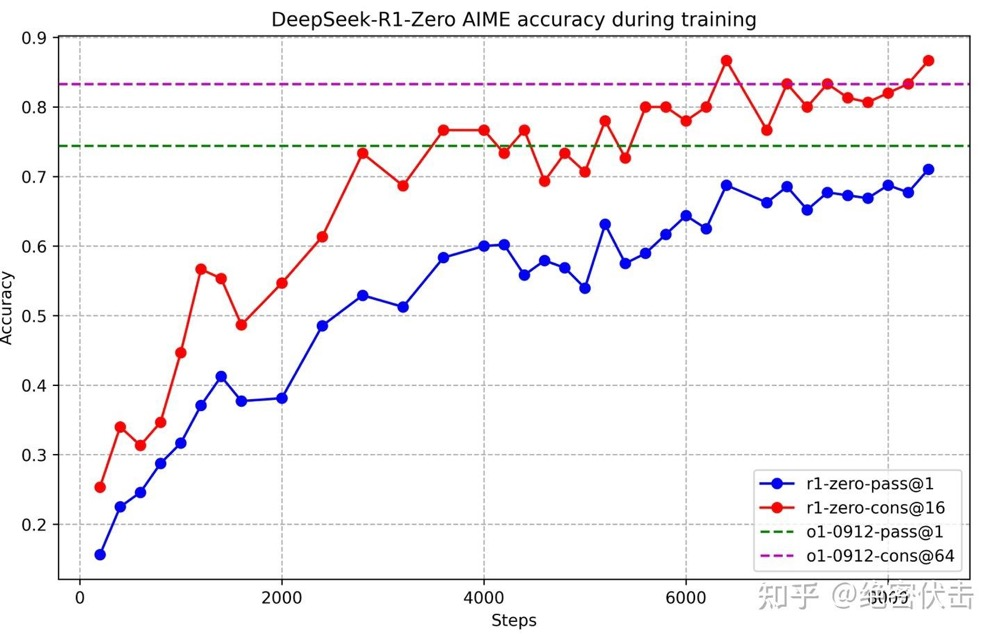

# 背景
## 研究问题
如何通过强化学习（RL）有效提升大型语言模型（LLM）的推理能力？

## 问题背景
* 近年来，LLM在各个领域都取得了显著进展，但是推理能力仍有提升空间
* 之前的研究大多依赖大量的SFT数据，但获取高质量的SFT数据成本高昂
* OpenAI的o1系列模型通过增加思维链（Chain-of-Thought,CoT）推理过程的长度来提升推理能力，但如何有效进行测试时扩展仍是开放问题
* 一些研究尝试使用基于过程的奖励模型（PRM）、强化学习（RL）和搜索算法（MCTS）来解决推理问题，但没有达到OpenAI的o1系列模型的通用推理性能水平

## 论文动机
探索是否可以通过纯强化学习来让LLM自主发展推理能力，而无需依赖SFT数据

# 相关概念和研究

> 大型语言模型（LLM）：Large Language Model，指通过大规模数据训练的高级人工智能算法，能够理解和生成自然语言，广泛应用于自然语言处理（NLP）领域。
> 
> 监督微调（SFT）：Supervised Fine-Tuning，是在预训练的基础上，使用标注良好的数据集对大型语言模型进行额外的训练，以便使其更好地执行特定任务。之前的研究通常依赖SFT来增强模型性能，然而SFT需要大量标注数据，成本高且耗时
>
> 推理时扩展：OpenAI的o1系列模型通过增加CoT推理长度来实现推理能力扩展，但测试时扩展的挑战仍存在
>
> 基于过程的奖励模型（PRM）：Process Reward Models，主要用于数学推理场景中，通过对每一个推理步骤进行评估和奖励，促使模型在解题过程中避免产生错误的中间结果。这类模型的目标时在推理流程中给予指导，而不是仅关注最终的答案是否正确。然而这些模型在实际应用中存在局限性
> 
> 强化学习（RL）：Reinforcement Learning，是一种机器学习方法，专注于智能体（agent）通过与环境（environment）的交互来学习如何做出决策。其核心思想是从试错中学习，以最大化累计奖励。强化学习已被用户提升推理能力，但通常于SFT数据结合使用，难以探索纯RL的潜力
> 

# 主要贡献

| 模型 | 方法 |
|---------------------|---------------------|
| DeepSeek-R1-Zero    | 纯强化学习 |
| DeepSeek-R1         | 冷启动SFT-》RL-》CoT+通用数据SFT（80W）-》全场景RL |
| 蒸馏小模型            | 直接使用上面的80W数据进行SFT |

* 首次验证了纯强化学习在LLM中显著增强推理推理的可行性（DeepSeek-R1-Zero），即无需预先的SFT数据，仅通过RL即可激励模型学会长链推理和反思能力
* 提出了多阶段训练策略（冷启动-》RL-》SFT-》全场景RL），有效兼顾准确率和可读性，产出DeepSeek-R1，性能比肩OpenAI-o1-1217
* 展示了知识蒸馏在提升小模型推理能力方面的潜力，并开源多个大小不一的蒸馏模型（1.5B～70B），为社区提供了可在低资源环境中也能获得高推理能力的模型选择

# DeepSeek-R1-Zero

DeepSeek-R1-Zero直接在基础模型上应用强化学习，不使用任何SFT数据。为了训练DeepSeek-R1-Zero，deepseek采用了一种基于规则的奖励系统，该系统主要由两种奖励组成
* 准确率奖励：准确率奖励模型评估响应是否正确。如在确有确定性结果的数据问题中，模型需要以指定的格式(box)提供最终答案，从而能够通过基于规则的验证来可靠地确认正确性
* 格式奖励：除了准确性奖励模型，还采用了一种格式奖励模型，要求模型将其思考过程放在特定标签之间，这意味着除了正确解答题目外，还需要清晰地展示解题思路。

需要强调的事：deepseek在训练DeepSeek-R1-Zero时没有使用结果奖励（ORM）或者过程奖励模型（PRM），在没有大量带过程标签（step-by-step annotation）的数据支撑下，模型如何知道自己的推理过程是否正确？
这里主要通过结果判定的方式：对于数据题、编程题等有客观正确答案的任务，可以把最终答案和标准结果对比给出奖励。虽然没有逐步的过程标注，但最终答案正确与否足以在RL中当作回报（Reward）来引导模型学会更好的推理。

## DeepSeek-R1-Zero性能
下图展示了DeepSeek-R1-Zero在AIME2024基准测试中的强化学习（RL）训练性能轨迹。随着RL训练的持续推进，DeepSeek-R1-Zero的性能呈现出稳步提升的趋势。其AIME2024的pass@1分数实现了显著飞跃，从最初的15.6%飙升到71%，达到了与OpenAI-o1-0912相媲美的性能水平。

## DeepSeek-R1-Zero的自我演化过程
DeepSeek-R1-Zero的自我演化过程生动地展现了强化学习（RL）如何自主推动模型提升推理能力。从基座模型直接开始RL训练，绕过了SFT阶段从而能够紧密跟踪模型的成长轨迹。
如下图所示通过延长测试时间的计算，DeepSeek-R1-Zero自然而然地获得了解决更复杂推理任务的能力，从生成数百个token到数千个token，模型得以更深入地探索和优化其思维过程
.jpg "DeepSeek-R1-Zero在RL过程中的平均响应长度(输出长度不断增加)")